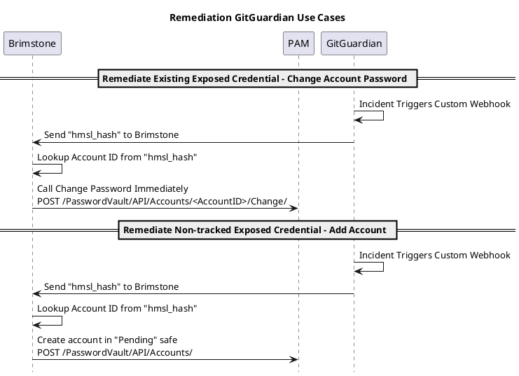
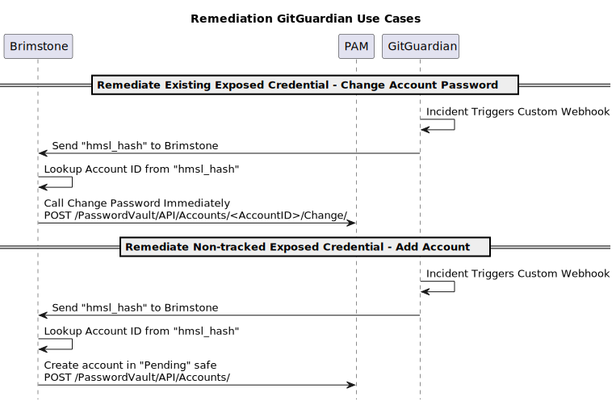
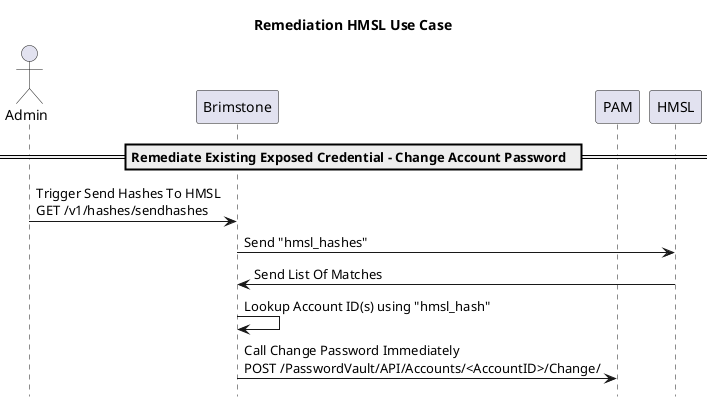
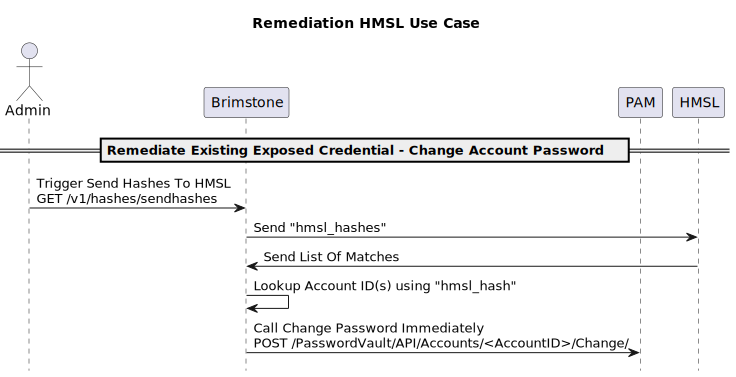

<!-- START doctoc generated TOC please keep comment here to allow auto update -->
<!-- DON'T EDIT THIS SECTION, INSTEAD RE-RUN doctoc TO UPDATE -->

* [Brimstone](#brimstone)
  * [Summary](#summary)
  * [Use Cases](#use-cases)
    * [Notable: Remediate Non-tracked Exposed Credential - Add Account](#notable-remediate-non-tracked-exposed-credential---add-account)
  * [Usage](#usage)
    * [Brimstone Service Endpoints](#brimstone-service-endpoints)
  * [Configuration](#configuration)
    * [Brimstone Service](#brimstone-service)
    * [Hailstone App](#hailstone-app)
  * [Walk Through](#walk-through)
    * [Setup](#setup)
    * [GG Incident Flow](#gg-incident-flow)
    * [HMSL Leak Flow](#hmsl-leak-flow)
  * [References](#references)
  * [Technologies](#technologies)
  * [Colophon](#colophon)
  * [License](#license)
  * [Contributing](#contributing)

<!-- END doctoc generated TOC please keep comment here to allow auto update -->

# Brimstone

<!--
Author:   David Hisel <david.hisel@cyberark.com>
Updated:  <2023-12-28 13:45:25 david.hisel>
-->

## Summary

Brimstone is a service that complements the [GitGuardian](https://www.gitguardian.com/) (GG) service [HasMySecretLeaked]( https://www.gitguardian.com/hasmysecretleaked) (HMSL).  It takes in and stores the HMSL hashes to facilitate remediation actions such as rotating a password if one is found to be leaked.

## Use Cases

| # | Trigger |  Data Source | Findings | Action | Use Case |
| - | - | - | - | - | - |
| 1 | Brimstone POST to HMSL | HMSL POST /v1/{prefixes,hashes} responses | No Matches | Do Nothing | If hash prefixes from Brimstone sent to HMSL return no matches, then this indicates no leaks of the PAM Accounts being tracked in Brimstone. |
| 2 | Brimstone POST to HMSL | HMSL POST /v1/{prefixes,hashes} responses | Matches Returned | For each "Matches" item, if it exists in Brimstone, then _Change Account Password_ | If hash prefixes from Brimstone sent to HMSL return matches, then this indicates that the PAM Account secret is leaked. |
| 3 | GG Incident | GG Custom Webhook Incident | No Matches In Brimstone | _Add Account_ in Pending Safe | GG tracks our own repos, so, if we find a secret in our codebase, immediately provision it. |
| 4 | GG Incident | GG Custom Webhook Incident | Matches In Brimstone | _Change Account Password_ | GG tracks our own repos, so, if we find a secret in our codebase, and it matches an account in the PAM Vault rotate it. |

<!--

-->



<!-- 

 -->



### Notable: Remediate Non-tracked Exposed Credential - Add Account

* When GitGuardian sends an incident to Brimstone, and there is no corresponding hmsl_hash, Brimstone will add an account to a pending safe.  When looking in the pending safe, and
  * "Address" will contain the GitGuardian incident url
  * "Platform ID" will be "DummyPlatform"
  * "Username" and Account "Name" will be derived from the GG incident URL

## Usage

### Brimstone Service Endpoints

* API Key header

  ```text
  Authorization: Bearer [[api key]]
  
  Example:
  Authorization: Bearer abcdef123456
  ```

* **PUT /v1/hashes**
  * Requires:
    * Content-type header, `Content-type: application/json`
    * Authorization Header, `Authorization: Bearer [[api key]]`
  * CPM plugin uses this endpoint to update hashes in Brimstone
  * Brimstone to accept payload, add new hashes and rotate hashes to Current-1, Current-2
  * Request body is `HashBatch` structure as serialized JSON
  * Example curl call:

    ```shell
    curl -X PUT \
    -H "Authorization: Bearer abcdef123456" \
    -H "Accept: application/json" \
    -H "Content-Type: application/json" \
    "http://127.0.0.1:9090/v1/hashes" \
    -d '{
      "hashes" : [ {
        "name" : "name1",
        "hash" : "hash1"
      }, {
        "name" : "name2",
        "hash" : "hash2"
      } ],
      "safename" : "safename1"
    }'
    ```

* **GET /v1/hashes/sendprefixes**
  * Requires Authorization Header, `Authorization: Bearer [[api key]]`
  * Trigger Brimstone to push current list of hashes as prefixes to HMSL

* **GET /v1/hashes/sendhashes**
  * Requires Authorization Header, `Authorization: Bearer [[api key]]`
  * Trigger Brimstone to push current list of full hashes to HMSL

* **POST /v1/notify/ggevent**
  * Brimstone will verify the incoming request per [GG Custom Webhook Doc](https://docs.gitguardian.com/platform/monitor-perimeter/notifiers-integrations/custom-webhook#how-to-verify-the-payload-signature)
  * Endpoint used to configure GG "custom webhook"

## Configuration

### Brimstone Service

| Parameter          | Example Value                                                                            | Required | Notes                                                                                                                           |
|--------------------|------------------------------------------------------------------------------------------|----------|---------------------------------------------------------------------------------------------------------------------------------|
| -keyvar            | `BRIMSTONE_API_KEY`                                                                      | N        | default env var name is `BRIMSTONE_API_KEY`                                                                                     |
| -hmslurl           | `https://api.hasmysecretleaked.com`                                                      | N        | HMSL url where to send hashes (Used as audience when sending JWT request), default value is `https://api.hasmysecretleaked.com` |
| -hmslaudtype       | `hmsl`                                                                                   | N        | Audience type for HMSL JWT request, default value is `hmsl`                                                                     |
| -ggapiurl          | `https://api.gitguardian.com`                                                            | N        | GG API URL, default is `https://api.gitguardian.com`                                                                            |
| -ggapitokenvar     | `GG_API_TOKEN_VARNAME`                                                                   | Y        | GG API token can be retrieved from GG Dashboard -> API -> Personal access tokens (default env var name: `GG_API_TOKEN`)         |
| -ggwebhooktokenvar | `GG_WEBHOOK_TOKEN_VARNAME`                                                               | Y        | GG API Token env var contains GG API token to use (default env var name: `GG_WEBHOOK_TOKEN`)                                    |
| -dburl             | `postgresql://root@localhost:26257/brimstone?sslmode=disable&application_name=brimstone` | N        | Database URL, default value is `postgresql://root@localhost:26257/brimstone?sslmode=disable&application_name=brimstone`         |
| -port              | `9191`                                                                                   | N        | Port whereon Brimstone listens, default: 9191                                                                                   |
| -idtenanturl       | `https://EXAMPLE.id.cyberark.cloud`                                                      | Y        | PAM config ID tenant URL                                                                                                        |
| -pcloudurl         | `https://EXAMPLE.privilegecloud.cyberark.cloud`                                          | Y        | PAM config Privilege Cloud URL                                                                                                  |
| -pamuser           | pam user                                                                                 | Y        | PAM config PAM User                                                                                                             |
| -pampass           | pam user password                                                                  | Y        | PAM config PAM Pass                                                                                                             |
| -safename          | `Pending`                                                                                | Y        | PAM config PAM Pending Safe Name.  Note: safe must already exist and pamuser can add and change accounts.                       |
| -version           |                                                                                          | N        | Print version and exit                                                                                                          |
| -d                 |                                                                                          | N        | Set output level to debug                                                                                                       |

### Hailstone App

| Parameter        | Example Value                                 | Required | Notes                                                                 |
|------------------|-----------------------------------------------|----------|-----------------------------------------------------------------------|
| -d               |                                               | N        | enable debug mode                                                     |
| -idtenanturl     | `https://EXAMPLE.id.cyberark.cloud`             | Y        | ID Tenant                                                             |
| -pcloudurl       | `https://EXAMPLE.privilegecloud.cyberark.cloud` | Y        | Privilege Cloud (or PAM self-hosted)                                  |
| -pamuser         | `pamuser@example.com`                           | Y        | PAM user - must have perms to add account and change account password |
| -pampass         | `mypassword`                                    | Y        | PAM user creds                                                        |
| -safename        | `pendingsafe`                                   | Y        | Safe name for Pending safe where new accounts will be added           |
| -brimstoneurl    | `http://brimstone.example.com:9191/v1/hashes`   | Y        | URL where to post hashes                                              |
| -brimstoneapikey | `abc123`                                        | Y        | API key to authn to Brimstone service                                 |

## Walk Through

### Setup

* Create a [GitGuardian account](https://dashboard.gitguardian.com/auth/signup?utm_source=github&utm_medium=product&utm_campaign=brimstone_repo)
* Create a GitHub repo and connect it to Gitguardian
* Create a safe in PAM vault to be used for new accounts, for this example "Pending" safe is used
* Deploy Brimstone where it can be accessed by GG custom webhook (see table for parameters)
* Configure GG custom webhook to send "incident" types to Brimstone endpoint, `/v1/notify/ggevent`

### GG Incident Flow

* In the GitHub repo, commit a secret and push it into GitHub
* Review the contents of the PAM safe for a new account

### HMSL Leak Flow

* Run the "GG Incident Flow" to generate a GG Incident, and create an account in PAM vault safe
* Run Hailstone app to load Brimstone with the secrets from the pending safe (Note: a user that has access to the pending safe is required)
* Call the send full hashes endpoint in Brimstone `GET /v1/hashes/sendfullhashes` -- this will send all the hashes in Brimstone to the HMSL service
* Review the contents of the pending safe and find the account, it should show that it requires a password change

## References

* [Learn more about HasMySecretLeaked](https://blog.gitguardian.com/announcing-has-my-secret-leaked/?utm_source=github&utm_medium=product&utm_campaign=brimstone_repo)
* [The Trustless and Secure Protocol powering HasMySecretLeaked](https://blog.gitguardian.com/hasmysecretleaked-building-a-trustless-and-secure-protocol/?utm_source=github&utm_medium=product&utm_campaign=brimstone_repo)
* [Documentation of HasMySecretLeaked's API](https://api.hasmysecretleaked.com/docs/?utm_source=github&utm_medium=product&utm_campaign=brimstone_repo)

* Other projects
  * [CyberArk Conjur](https://github.com/conjurdemos)
  * [CyberArk](https://github.com/cyberark)

## Technologies

* go "1.21.5"
* cockroach db "Build Tag: v23.1.11"
* openapi "3.0.0"
  * oapi-codegen "v1.16.2"
  * Optional
    * npm "10.2.4"
    * redocly "1.6.0"

* Optional document tools
  * doctoc "doctoc@2.2.1"
  * plantuml "v1.2023.12"
  * dot "dot - graphviz version 2.43.0 (0)"

## Colophon

Brimstone - archaic term for sulfur -> sulfur is the stuff "matches" are made from.  Brimstone, the app, curates the stuff "matches" are made from.  E.g., the hashes are matched with other hashes.

## License

  Copyright (c) 2024 CyberArk Software Ltd. All rights reserved.

  Licensed under the Apache License, Version 2.0 (the "License");
  you may not use this file except in compliance with the License.
  You may obtain a copy of the License at

  <http://www.apache.org/licenses/LICENSE-2.0>

  Unless required by applicable law or agreed to in writing, software
  distributed under the License is distributed on an "AS IS" BASIS,
  WITHOUT WARRANTIES OR CONDITIONS OF ANY KIND, either express or implied.
  See the License for the specific language governing permissions and
  limitations under the License.

For the full license text see [`LICENSE`](LICENSE).

## Contributing

We welcome contributions of all kinds to this repository. For
instructions on how to get started and descriptions of our development
workflows, please see our [contributing
guide](CONTRIBUTING.md).

[Code of Conduct](CODE_OF_CONDUCT.md).
